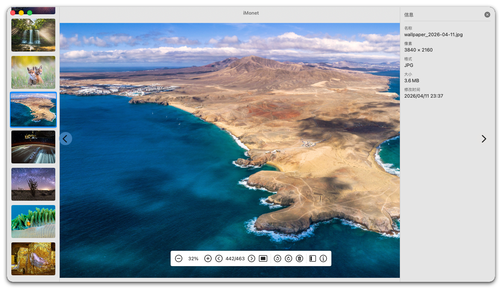
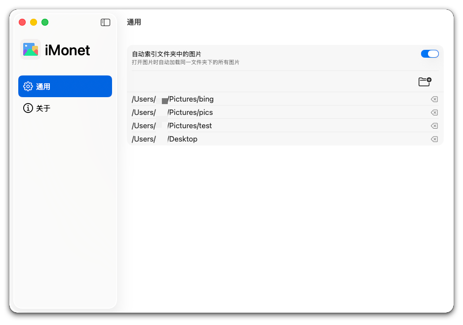

[](https://swift.org/)
[](https://developer.apple.com/xcode/swiftui/)
[](https://www.apple.com/macos/)

<div align="center">
   
</div>

# Monet

专为鼠标用户优化的 macOS 看图工具。基于 SwiftUI 构建。

[](https://apps.apple.com/cn/app/imonet/id6770070921?mt=12)

> [English](README.md)

## Demo

https://github.com/user-attachments/assets/f9faccb3-531e-4000-bc7f-e58fb922e6da

## 截屏

<div align="center">
   <table>
     <tr>
       <td></td>
       <td></td>
     </tr>
   </table>
   
</div>

## 功能特性

### 图片浏览
- **文件夹索引**：自动扫描并索引同目录下的所有图片
- **持久化权限**：基于安全范围书签（security-scoped bookmark），只需授权一次即可永久访问
- **支持格式**：PNG、JPEG、GIF、WebP
- **侧边栏**：缩略图快速导航，仅有一张图片时自动隐藏

### 鼠标 & 键盘
- **方向键**：←/→/↑/↓ 切换图片
- **Cmd + 滚轮**：以鼠标位置为中心缩放
- **鼠标拖拽**：平移已放大的图片
- **点击显隐**：点击图片区域唤出控件，5 秒后自动隐藏

### 浮动 UI
- **标题栏 & 工具栏**：点击出现，5 秒后自动隐藏；鼠标悬停工具栏可保持显示
- **图片信息面板**（右侧）：像素尺寸、文件大小、格式、修改日期
- **深色 / 浅色模式**：完整的自适应主题支持
- **菜单栏快捷入口**：可通过菜单栏快速访问

## 环境要求

- macOS 15.0 或更高版本
- Swift 6.0+

## 构建 & 运行

```bash
git clone https://github.com/wflixu/Monet.git
cd Monet
swift run
```

构建 Release `.app` 包：

```bash
xcodebuild -scheme Monet -configuration Release -derivedDataPath build -destination "platform=macOS,arch=arm64" ARCHS=arm64 ENABLE_HARDENED_RUNTIME=YES build
```

## 项目结构

```
Monet/
├── Sources/Monet/
│   ├── MonetApp.swift              # 入口、场景、AppDelegate
│   ├── AppState.swift              # 全局应用状态
│   ├── ContentView.swift           # 主布局，控件自动显隐逻辑
│   ├── NavigationIdentifier.swift  # 设置导航
│   ├── Views/
│   │   ├── ImagePreviewView.swift  # 图片显示与键盘事件
│   │   ├── ImageThumbnailView.swift
│   │   ├── ThumbnailSidebar.swift  # 左侧缩略图条
│   │   ├── ImageInfoPanel.swift    # 右侧信息面板
│   │   ├── ToolbarView.swift       # 底部浮动工具栏
│   │   └── ZoomableImageView.swift # 缩放平移图片视图（AppKit）
│   ├── Settings/
│   │   ├── GeneralSettingsPane.swift
│   │   ├── AboutSettingsPane.swift
│   │   ├── SettingsView.swift
│   │   └── SettingsWindow.swift
│   ├── Permission/
│   │   └── PermissionsManager.swift
│   └── Shared/
│       ├── AppLogger.swift         # @AppLog 属性包装器
│       ├── Constants.swift
│       └── Util.swift              # ObjectAssociation
├── Tests/
└── Package.swift
```

## 依赖

- **[SwiftUITooltip](https://github.com/quassum/SwiftUI-Tooltip)** — 工具提示

## 快捷键

| 按键 | 操作 |
|-----|--------|
| ← / → | 上一张 / 下一张 |
| ↑ / ↓ | 上一张 / 下一张 |
| Cmd + 滚轮 | 以鼠标位置为中心缩放 |
| 鼠标拖拽 | 平移已放大的图片 |

## 许可证

GNU General Public License v3.0 — 详见 [LICENSE](LICENSE)。
